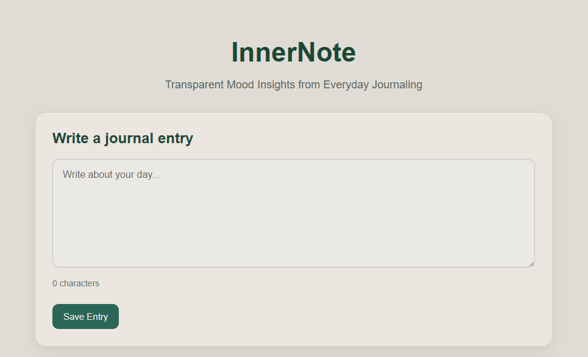
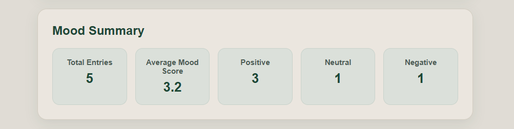
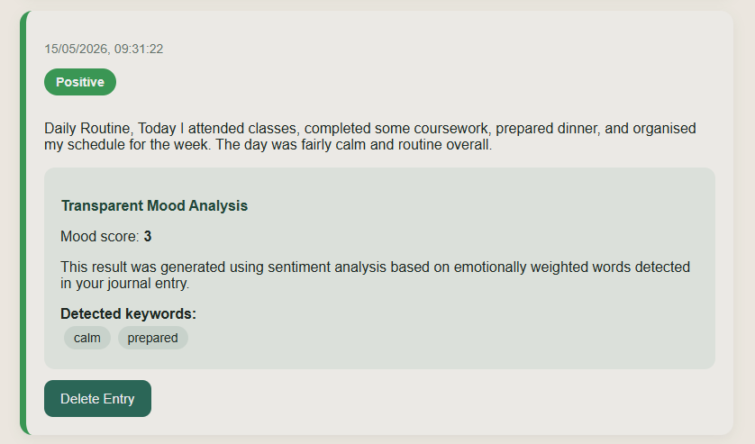
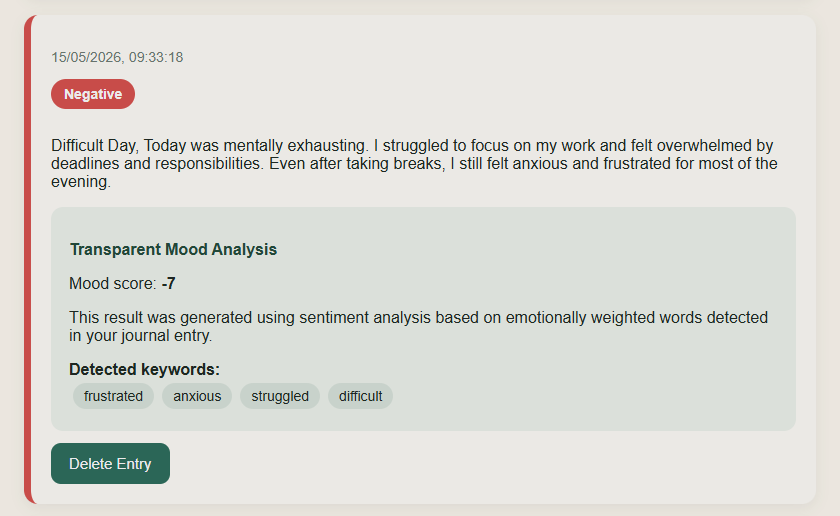

# InnerNote – Transparent Mood Insights from Everyday Journaling

A full-stack web application designed to combine reflective journaling with transparent sentiment analysis.

InnerNote allows users to write journal entries, receive lightweight mood insights generated through Natural Language Processing, and review emotional trends over time in a simple and understandable way.

Unlike many mood-tracking systems that operate as “black boxes”, InnerNote focuses on transparency by exposing sentiment scores, detected keywords, and explanation panels directly to the user.

---

## Features

- Create and store reflective journal entries  
- Lightweight sentiment analysis using NLP  
- Automatic mood classification (positive, neutral, negative)  
- Transparent mood insights with detected keywords  
- Mood summary dashboard with reflective statistics  
- Persistent cloud-based storage using MongoDB Atlas  
- Delete journal entries dynamically  
- Responsive and minimal user interface  
- Real-time frontend updates using React state management  
- REST-style API communication between frontend and backend  

---

## Screenshot (Homepage)



---

## Screenshot (Mood Summary Dashboard)



---

## Screenshot (Positive Mood Analysis)



---

## Screenshot (Negative Mood Analysis)



---

## Technologies Used

- React  
- Vite  
- Node.js  
- Express.js  
- MongoDB Atlas  
- Mongoose  
- JavaScript  
- HTML & CSS  
- Git & GitHub  

---

## How to Run

### 1. Clone the repository

```bash
git clone https://github.com/Messtiso/InnerNote.git
```

### 2. Navigate into the project folder

```bash
cd InnerNote
```

### 3. Install frontend dependencies

```bash
cd frontend
npm install
```

### 4. Install backend dependencies

```bash
cd ../backend
npm install
```

### 5. Create a `.env` file inside the backend folder

```env
MONGO_URI=your_mongodb_connection_string
```

### 6. Start the backend server

```bash
node server.js
```

### 7. Start the frontend development server

Open a second terminal:

```bash
cd frontend
npm run dev
```

---

## Example Workflow

1. Write a reflective journal entry  
2. Submit the entry for analysis  
3. Receive a mood classification and sentiment score  
4. Review detected keywords and explanation panels  
5. Track emotional trends through the dashboard  
6. Retrieve or delete previous entries dynamically  

---

## Future Improvements

- User authentication and personal accounts  
- Advanced mood trend visualisations  
- More sophisticated NLP models  
- Mobile-first optimisation  
- Personalised reflective prompts  
- Enhanced privacy and encryption features  
- Search and filtering functionality  

---

## Project Purpose

This project was developed as a final-year Computing project focused on:
- Full-stack web development  
- Transparent AI-assisted systems  
- Natural Language Processing  
- Explainable sentiment analysis  
- User-centred interface design  

The goal of InnerNote was not to create a clinical mental health platform, but rather to explore how lightweight and understandable mood-analysis functionality could be integrated into a reflective journaling application.

---

## End

Thank you for checking out InnerNote :)
